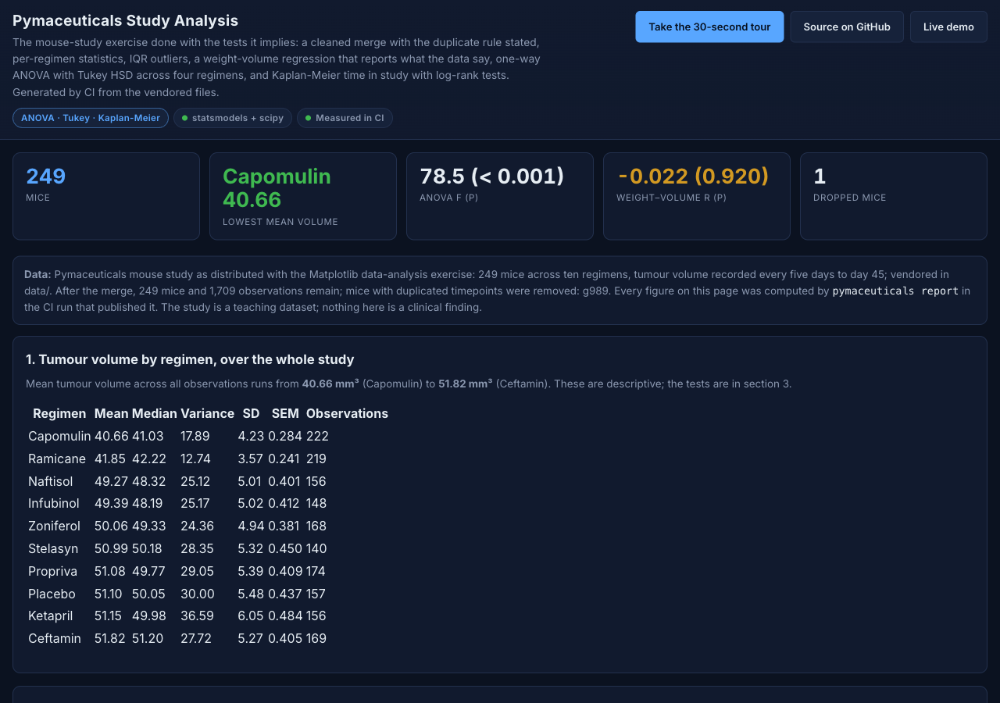
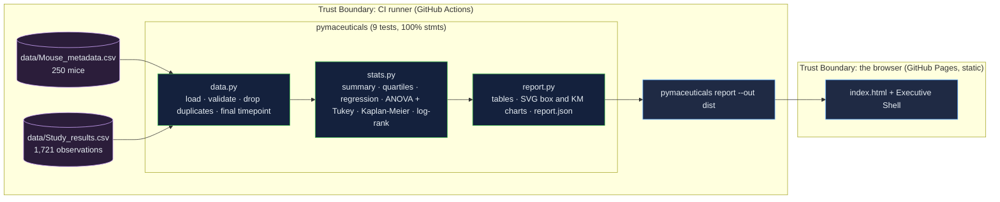

# MedicalTreatment-Analytics: the mouse-study exercise with the tests it implies, and a README that matches the data

[](https://github.com/Freddricklogan/MedicalTreatment-Analytics/actions/workflows/deploy.yml)
[](#5-getting-started--verification)
[](https://github.com/Freddricklogan/MedicalTreatment-Analytics/actions/workflows/codeql.yml)
[](LICENSE)
[](https://freddricklogan.github.io/MedicalTreatment-Analytics/)

## 1. Executive Summary & Business Impact

**Problem statement.** The Pymaceuticals exercise asks which of ten
regimens reduces tumour volume in mice. The previous version of this
repository was a script with its PNG outputs committed, uncorrected
pairwise t-tests, and a README reporting a 0.84 weight–volume
correlation that the committed data do not contain — on these files
the correlation is −0.02 (`AUDIT.md`).

**Solution & value delivered.** A package that cleans the merge with
the duplicate rule stated, summarises tumour volume per regimen, finds
outliers by the 1.5 × IQR rule, regresses volume on weight and reports
what it finds, runs one-way ANOVA with Tukey HSD across four regimens
(F = 78.5; Capomulin and Ramicane indistinguishable from each other,
both different from Infubinol and Ceftamin), and estimates time in
study with Kaplan–Meier curves and log-rank tests against placebo.
CI runs it and publishes the report; the README's numbers are the
report's.

**[→ Read the full case study](docs/CASE_STUDY.md)**



## 2. Demonstrated Competencies & Technical Skills

- **Statistics** — descriptive statistics with SEM, IQR outliers,
  linear regression, one-way ANOVA, Tukey HSD with adjusted p-values,
  Kaplan–Meier estimation with censoring, log-rank tests.
- **Data Engineering** — validated merge, documented duplicate rule,
  final-timepoint selection, vendored data with provenance.
- **Engineering Practice** — typed package with a CLI, 9 tests at
  100 % statement coverage with hand-computed checks, ruff / mypy
  strict / bandit / pip-audit / Trivy, report generated and deployed by
  CI.

## 3. System Architecture & Data Flow



## 4. Technical Highlights & Engineering Decisions

### ADR-1 — Report what the committed data say

**Context.** The README repeated the textbook correlation; the
committed files are a variant that does not show it.

**Decision.** Every number on the page and in this README comes from
`pymaceuticals report` run on `data/`; the page states that the earlier
0.84 was not computed from these files.

**Consequence.** r = −0.022 (p = 0.92) is printed where a reader
expects 0.84, with the explanation beside it.

### ADR-2 — ANOVA and Tukey instead of uncorrected t-tests

**Context.** Three t-tests against Capomulin declared everything
significant with no correction.

**Decision.** One-way ANOVA across the four regimens, then Tukey HSD
over the six pairs with adjusted p-values.

**Consequence.** The honest picture: Capomulin vs Ramicane is not
significant (adjusted p = 0.312); Ceftamin vs Infubinol is borderline
(0.059); the other four pairs differ at p < 0.001.

### ADR-3 — Survival by Kaplan–Meier with censoring

**Context.** "Mouse deaths" were asserted from a table.

**Decision.** Each mouse's last timepoint is its time in study; leaving
before day 45 is an event, day 45 is censored; `statsmodels`
`SurvfuncRight` estimates the curve and `survdiff` gives the log-rank
test against placebo.

**Consequence.** Events per regimen are counted (Capomulin 4, Ramicane
5, Infubinol 16, Ceftamin 16 of 24–25) and a test checks the estimate
against the exact hand value 20/24.

## 5. Getting Started & Verification

**Prerequisites.** Python 3.12 and `uv`.

```bash
git clone https://github.com/Freddricklogan/MedicalTreatment-Analytics.git
cd MedicalTreatment-Analytics
uv venv && uv pip install -e ".[dev]"
make check                                # lint, typecheck, test, security, build
uv run pymaceuticals report --out dist    # dist/index.html + report.json
```

**Verification — the numbers this repository actually produced:**

| Check | Result |
| --- | --- |
| Tests (pytest) | **9 passed / 9** |
| Coverage | **100%** statements over `pymaceuticals` (CLI excluded) |
| ruff, ruff format, mypy --strict | clean |
| bandit, pip-audit | 0 findings; no known vulnerabilities |
| Cleaning | 250 mice in metadata; `g989` dropped for duplicated timepoints → 249 mice, 1,709 observations |
| Summary | lowest mean volume Capomulin 40.66 mm³; highest Ceftamin 51.82 mm³ |
| Outliers (1.5 × IQR, final volume) | Ceftamin 71.82 mm³; none for Capomulin, Ramicane, Infubinol |
| ANOVA / Tukey | F = 78.5, p < 0.001; Capomulin–Ramicane adjusted p 0.312 (no); Ceftamin–Infubinol 0.059 (no); other pairs < 0.001 |
| Regression (Capomulin, n = 24) | r = −0.022, r² 0.0005, p 0.920 |
| Survival | events before day 45: Capomulin 4/24, Ramicane 5/25, Infubinol 16/25, Ceftamin 16/25 |
| Report smoke (headless Chrome) | **0 console errors**; 4 tables, 2 SVG charts, 4 tour steps; no horizontal scroll at 1280 or 400 px |

## 6. Live Demo & Production Showcase

**<https://freddricklogan.github.io/MedicalTreatment-Analytics/>** — the
report CI built, with `report.json` beside it.

**30-second guided walkthrough.** Press **Take the 30-second tour**:
the cleaning rule, outliers by rule, the tests, and time in study.
